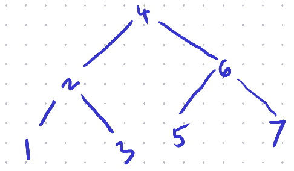

[:material-file-pdf-box: Download this page as PDF](./index.pdf)

## Graph Representations

### Vertex Insertion

##### Question

$\overline{\mathit{ABCD}}$ is a closed quadrilateral.
A new vertex $E$ is introduced between $B$ and $C$.
Show the adjacency lists before and after the
introduction of $E$.  Hence, write an algorithm/
pseudocode in order to introduce a new vertex between
an existing edge.

##### Interpretation

Given a closed quadrilateral
$\overline{\mathit{ABCD}}$, the adjacency list in
1-indexed format is given as:

    V = [A, B, C, D]
    Adj = [[2, 4],                  # 1 is connected to 2 and 4
           [1, 3],                  # 2 is connected to 1 and 3
           [2, 4],                  # and so forth
           [1, 3]]

Here the edge $\overline{\mathit{BC}}$ is defined in
two entries of the adjacency list, *i.e.* as vertex `3`
in `Adj[2]` and vertex `2` in `Adj[3]`.

##### Solution

In order to introduce a new vertex $E$ between edge
$\overline{\mathit{BC}}$,

###### Step 1

Append vertex $E$ to the vertex list $V$ and get its
index.

    V = [A, B, C, D, E]             # Add E as V[5]

###### Step 2

Remove the edge  $\overline{\mathit{BC}}$

    V = [A, B, C, D, E]
    Adj = [[2, 4],
           [1],                     # remove 3 from Adj[2]
           [4],                     # remove 2 from Adj[3]
           [1, 3],
           []]                      # add empty Adj[5]

###### Step 3

Add edges $\overline{\mathit{BEC}}$

    V = [A, B, C, D, E]
    Adj = [[2, 4],
           [1, 5],                  # add 5 to Adj[2]
           [4, 5],                  # add 5 to Adj[3]
           [1, 3],
           [2, 3]]                  # add 2, 3 to Adj[5]

###### Algorithm

To introduce a vertex $W$ between an edge $(u,v)$,

    GRAPH_ADD_VERTEX_BW(G,W,u,v) :
      w = G.V.append(W)             # Insert W into list of
                                    # vertices and store the
                                    # last appended index.
    
      G.Adj[u].remove(v)            # Remove v from Adj[u]
      G.Adj[v].remove(u)            # Remove u from Adj[v]
    
      G.Adj[u].append(w)            # Append w into Adj[u]
      G.Adj[v].append(w)            # Append w into Adj[v]
    
      G.Adj[w].append(u)            # Append u into Adj[w]
      G.Adj[w].append(v)            # Append v into Adj[w]

**PS**: Here, $W$ in uppercase refers to a variable
(*i.e.* vertex information like coordinates of a point
etc.) that needs to appended into the list of verts
$G.V$. And $(u,v)$ represent the indices of the pair of
verts that constitute and edge.  We are interested in
the Adjacency List (as required by the question,) hence
the use of $G.Adj$

### Transpose Graph

##### Question

Given a graph $G(V,M)$, $M$ being the adjacency matrix.
A transpose graph would be the one with same set of
vertices, but a transposed adjacency matrix, *i.e.*
$G^{\top}(V,M^{\top})$.   
What does a transpose graph represent?  Illustrate with
a drawing to support your answer.

##### Interpretation

Recall that,

1.  In an adjacency matrix $A$, the component at
    $i^{\text{th}}$ row, and $j^{\text{th}}$ column is
    given as $a_{ij}$ and it represents whether the edge
    $v_{i}\to v_{j}$ exists.
2.  A transpose graph $G^{\top}(V,M^{\top})$ would be
    any different *iff* $M\ne M^{\top}$.  In other
    words, if $G$ is a directed graph.
3.  The components in the transposed matrix are mirrored
    across the diagonal.  Hence, if $B = A^{\top}$, then
    $b_{ij} = a_{ji}$.

##### Solution

Each edge $v_{i}\to v_{j}$ in $G$, transforms to
$v_{j}\to v_{i}$ in the transpose graph $G^{\top}$.
In other words, the edges are reversed.

This would be any different only in case of a directed
graph.  Since for an undirected graph $M=M^{\top}$

Hence, the transpose graph $G^{\top}(V,M^{\top})$
represents $G(V,M)$ with edges reversed.

##### Illustration

[TODO]

### (In/Out)-degree

##### Question

What is the average in-degree of a graph $G(V,E)$,
where $E$ is the set of edges in $G$?

##### Solution

In-degree of a vertex is defined as the number of
edges leading onto itself.

Let $d_{\mathrm{in}}(v)$ represent the in-degree of
vertex $v$.  Then the average in-degree is given as the
sum of in-degrees divided by the size of number of
verts,

\begin{align*}
  \mathbb{E}[d_{\mathrm{in}}(v)]
  &= \frac{\sum_{v\in V}d_{\mathrm{in}}(v)} {|V|}
\end{align*}

Intuitively speaking, the sum of all in-degrees is the
same as the number of edges. Hence,

\begin{align*}
  \mathbb{E}[d_{\mathrm{in}}(v)]
  &= \frac{|E|} {|V|}
\end{align*}

##### In further detail

In-degree of a vertex is the same as counting the
non-zeros in one (specific) column of an adjacency
matrix representation $M$ for the set of edges $E$.

Similarly, the sum $\sum_{v\in V}d_{\mathrm{in}}(v)$ is
equivalent to

-   Counting the non-zeros for every the column of $M$,
-   *i.e.* Counting all the non-zeros in $M$,
-   *i.e.* The number of edges.

Hence,

\begin{align*}
  \sum_{v\in V} d_{\mathrm{in}}(v)
    &= |E|
\end{align*}

### Representation

##### Question

Provide an adjacency list as well as the adjacency matrix
representation for trees A and B in the following figure.

Tree A

Tree B

##### Solution

###### Tree A

    Adj = [[2 3] 
           [1 4 5] 
           [1 6 7] 
           [2]
           [2]
           [3]
           [3]]
    
    M = [[0 1 1 0 0 0 0]
         [1 0 1 1 0 0 0]
         [1 0 0 0 1 1 0]
         [0 1 0 0 0 0 0]
         [0 1 0 0 0 0 0]
         [0 0 1 0 0 0 0]
         [0 0 1 0 0 0 0]]

###### Tree B

    Adj = [[2]
           [1 3 4]
           [2]
           [2 6]
           [6]
           [4 5 7]
           [6]]
    M = [[0 1 0 0 0 0 0]
         [1 0 1 1 0 0 0]
         [0 1 0 0 0 0 0]
         [0 1 0 0 0 1 0]
         [0 0 0 0 0 1 0]
         [0 0 0 1 1 0 1]
         [0 0 0 0 0 1 0]]

###### PS

The Adjacency matrix of Tree B is bi-symmetric.

## Elementary Algorithms

### BFS

##### Question

_Graph A_

With reference to Graph A  **Determine algorithmically**,

1.  The shortest path weight $\delta(u,j)$ for the pair
    $(u,j)$ of vertices.
2.  A shortest path between the pair $(u,j)$ of
    vertices.
3.  All shortest-paths originating from vertex $u$.

_BFS on Graph A_

##### Key Insight

All the three questions here speak about a shortest
path originating from vertex $u$.  This is a uniformly
weighted undirected graph, *i.e.* all edges are equally
weighted.  The solution for shortest path will follow a
BFS in such a case.

##### Solution

1.  Running a BFS on the graph gives us the figure, “BFS
    on Graph A” 
    upon termination.
2.  The numbers marked are discovery times of the nodes   
    $v\cdot d \ \forall v\in V$.
3.  For part (1) the shortest path weight is given as
    $\delta(u,j) = j\cdot d - u\cdot d$.  Computing from
    the figure, $\delta(u,j) = 4-0 = 4$.
4.  For part (2) we may pick any one path such that each
    successive node is from successive level.  *i.e.*
    one of,
    
    1.  $\langle u,v,h,i,j\rangle$,
    2.  $\langle u,v,w,y,j\rangle$, or
    3.  $\langle u,v,x,y,j\rangle$.
    
    Recall, that only one of these is, and not all of
    them are, the required shortest path (*i.e.*
    discovered in one run).

5.  For part (3), a BFS tree is required.  It’s been
    left that upon the reader to exercise and present as
    necessary.  An easy way out would be to use the
    adjoining graph
     and
    additionally mark each connection from “parent” to
    “child” as descended during the BFS.  Note that the
    arrow would be a manifestation of line `v.PI = u` in
    the algorithm [(link to the slide)](https://docs.google.com/presentation/d/14PY-Sc50QsFxdUqZk7GlYVwwEXzO38rg9z9KKx5ti0k/edit#slide=id.g32a7028b731_0_60).  Recall that
    there may be only one parent to a child, not many,
    and that the discovery time of the parent is always
    less than that of the child.

### DFS

##### Question

Given that there are 10 courses in a programme, and
corresponding pre-requisites are listed as under,
**determine algorithmically** If the programme may be
completed successfully by a candidate?

1.  depends upon 2 and 3;
2.  depends upon 3 and 4;
3.  depends upon none;
4.  depends upon none;
5.  depends upon 4 and 6;
6.  depends upon none;
7.  depends upon 5 and 8;
8.  depends upon 4, 6 and 10;
9.  depends upon 2, 4 and 8;
10. depends upon 6 and 9.

##### Key Insight

We define a relationship $u\to v$ if course $u$ depends
upon $v$ (*i.e.* if course $v$ is a pre-requisite of
course $u$).  Then we get a dependency graph (*i.e.* a
directed graph where relationship is defined when the
parent is dependent upon the child).

A topological order $T\equiv\langle v_{1},\ldots,v_{k}
\rangle$ of such a graph means that all ancestors of
$v_{i}$ have been listed before $v_{i}$ itself $\forall
v_{i}\in V$.  In simple words, the topological order is
one possible order of courses to complete the
programme.

However, the topological order is not always possible.
From [our slides](https://docs.google.com/presentation/d/14PY-Sc50QsFxdUqZk7GlYVwwEXzO38rg9z9KKx5ti0k/edit#slide=id.g32a7028b731_0_377), we know that topological order is
defined only for a directed acyclic graph (DAG).
**Hence, one may complete the programme iff the
dependency graph is acyclic.**

And **a graph is acyclic if and only if there are no
back edges.**

##### Solution

1.  Run a DFS on Dependency Graph;
2.  Maintain a list $T$ for Topological Order;
3.  Upon finishing the visit to a node, insert the node
    to the front of the list;
4.  Exit “abnormally,” if encountered a “back edge.”

If exited abnormally, the graph has a cycle; and the
programme can not be completed successfully.

Otherwise, the graph is acyclic, and $T$ contains an
order of courses that successfully completes the
programme.

In figure “DFS on Dependency Graph,”
 nodes
have been mentioned with discovery and finish times;
and edges have been labelled as B,C,F,T for back edges,
cross edges, forward edges and tree edges respectively.

The algorithm terminated upon visiting the edge $9\to
8$ which is a back edge (labelled B).

**Hence the programme can not be completed.**

_DFS on the Dependency Graph_

## Problem Solving

### Three jug problem

##### Question

There are three unmarked jugs $A,B,C$ with a capacity
of 8, 5 and 3 units respectively.  Possible moves may
either empty a can into another or fill the other,
whichever occurs earlier.  Starting with $A8,B0,C0$,
**determine algorithmically** if and how we can reach to
a split of $A4,B4,C0$.

_BFS on State Graph_

##### Key Insight

1.  The jugs are unmarked.  Hence, there is no way to
    determine any intermediate quantity while pouring.
2.  For every state reachable from any other state, at
    least one of the jugs is either empty or full.  This
    is a direct consequence of a *possible move*
    (action,) as defined in the problem.
3.  Each jug may be poured into the other two, so there
    may be 6 actions.  But at every state, at least one
    jug is empty or full; the number of actions is
    limited to 4.
4.  Some moves are reversible, *e.g.* $A8,B0,C0
       \rightleftharpoons A3,B5,C0$.  As a consequence, the
    resultant state graph is cyclic in nature.

##### Solution

-   **State Space:** is a 3-vector $\mathbf{v} \equiv
      Aa,Bb,Cc$ that satisfies,
    
    \begin{align*}
    \boldsymbol{0}
      \leqslant \begin{bmatrix}a&b&c \end{bmatrix}^{\top}
      & \leqslant \begin{bmatrix}8&5&3 \end{bmatrix}^{\top}
      \\
      a+b+c &= 8
    \end{align*}

-   **Start State:** $\mathbf{s}=A8,B0,C0$

-   **Actions:** Pour from jug, until the latter is full,
    or else empty the former.

Since the state graph is cyclic in nature, our solution
is based out of BFS. See the figure titled, “BFS
on State Graph.”

### Three jug problem 2

##### Question

There are three unmarked jugs $A,B,C$ with a capacity
of 8, 5 and 3 units respectively.  Possible moves may
either empty a can into another or fill the other,
whichever occurs earlier.  Starting with $A8,B0,C0$,
can we can reach to a split of $A4,B3,C1$.

##### Solution

*(This is a logical deduction, not an algorithmic
solution.)*

From our key insights *(earlier)*,

> For every state reachable from any other state, at
> least one of the jugs is either empty or full.

The state $A4,B3,C1$ has neither of the jugs empty, nor
full!  **Hence this is not a reachable state!**

