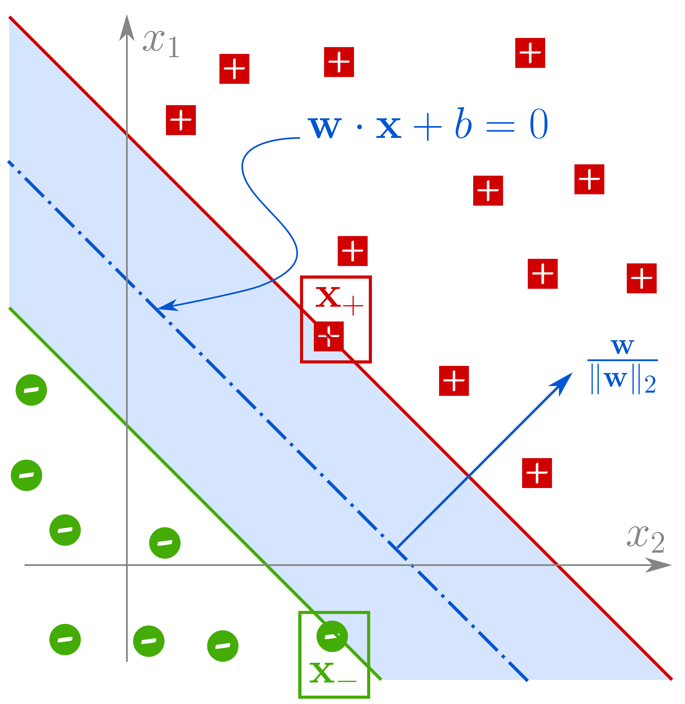

[:material-file-pdf-box: Download this page as PDF](./index.pdf)

## Setup

1.  Given is a set of paired observations $\mathcal{D}$
    (aka evidence), where targets $y\in\mathbb{R}$ are
    paired with ($d$ dimensional) features
    $\mathbf{x}\in\mathbb{R}^{d}$.
2.  We propose a mathematical model (typically a
    “family” of functions)
    $\mathcal{F}_{\boldsymbol{\theta}} : \mathbb{R}^{d}
       \to \mathbb{R}$ parameterised by
    $\boldsymbol{\theta}$
3.  So that $y\approx
       \mathcal{F}_{\boldsymbol{\theta}_{*}} (\mathbf{x})$.
    Here $y$ are referred to as targets,
    $\mathcal{F}_{\boldsymbol{\theta}} (\mathbf{x})$ are
    referred to as predictions; so that predictions
    approximate the targets, under optimal set of learnt
    parameters, ${\boldsymbol{\theta}_{*}}$.
4.  We express this formally as:   
    Find ${\boldsymbol{\theta} =
       {\boldsymbol{\theta}_{*}}}$ in order to
    
    \begin{align*}
      \underset{\boldsymbol{\theta}} {\text{minimise}}
      \quad
      &\underset{y,\mathbf{x}\sim\mathcal{D}}{\mathbb{E}}
        \left[ \Delta(y, \mathcal{F}_{\boldsymbol{\theta}}
        (\mathbf{x})) \right]
    \end{align*}
    
    where, $\Delta$ is the notion of distance between
    predictions $\mathcal{F}_{\boldsymbol{\theta}}
       (\mathbf{x})$ and targets $y$.

## Linear Regression

### In 2D

\begin{align*}
  y \approx \mathcal{F}_{w,b}(x)
  &= wx+b \\
  \Delta\left(y, \mathcal{F}_{w,b}(x)\right)
  &= \frac12 \left(y - \mathcal{F}_{w,b}(x) \right)^2
\end{align*}

The objective is to find $w=w_*$, $b=b_*$ in order to

\begin{align*}
  \underset{w,b}{\text{minimise}}
  &\quad \underset{y,x\sim\mathcal{D}}{\mathbb{E}}
    \left[ \frac12 \left(y - \mathcal{F}_{w,b}(x)
    \right)^2 \right]
\end{align*}

The analytical solution yields,

\begin{align*}
  w_* &= \frac{\mathrm{coVar}(x,y)}{\mathrm{Var}(x)} \\
  b_* &= \mathbb{E}[y]-w_*\mathbb{E}[x] \\
  \mathrm{coVar}(x,y) &= \mathbb{E}[xy] -
                        \mathbb{E}[x]\mathbb{E}[y] \\ 
  \mathrm{Var}(x) &= \mathbb{E}[x^2]-\mathbb{E}^2[x]
\end{align*}

### In Higher Dimensions

\begin{align*}
  y \approx \mathcal{F}_{\mathbf{w}}(\mathbf{x})
  &= \mathbf{w}^{\top}\mathbf{x} =
    \mathbf{x}^{\top}\mathbf{w} \\
  &= w_0 + w_1x_1 + \cdots + w_dx_d \qquad (x_0 = 1) \\
  \Delta\left(y, \mathcal{F}_{\mathbf{w}}(\mathbf{x})
  \right)
  &= \frac12 \left(y -
    \mathcal{F}_{\mathbf{w}}(\mathbf{x}) \right)^2  \\
  &= \frac12 \left(y -
    \mathbf{x}^{\top}\mathbf{w} \right)^2  \\
\end{align*}

The objective is to find $\mathbf{w}=\mathbf{w}_*$ in
order to

\begin{align*}
  \underset{\mathbf{w}}{\text{minimise}}
  &\quad \underset{y,\mathbf{x}\sim\mathcal{D}}{\mathbb{E}}
    \left[ \frac12 \left(y - \mathbf{x}^{\top}\mathbf{w}
    \right)^2 \right] \\
  \text{or,}\quad \underset{\mathbf{w}}{\text{minimise}}
  &\quad \frac12 (\mathbf{y}-X\mathbf{w})^{\top}
    (\mathbf{y}-X\mathbf{w}) \\
  \text{where,}\quad \mathbf{y}\equiv\begin{bmatrix}
    y_1 \\ \vdots \\ y_N
  \end{bmatrix} &\quad X \equiv \begin{bmatrix}
    \mathbf{x}_1^{\top} \\ \vdots \\
    \mathbf{x}_N^{\top}
  \end{bmatrix}
\end{align*}

The analytical solution yields,

\begin{align*}
  \mathbf{w}_* &= (X^{\top}X)^{-1}X^{\top}\mathbf{y}
\end{align*}

### Implementation

#### In Spreadsheet

This [(Google Sheet)](https://docs.google.com/spreadsheets/d/1MrwsA75WUano_aKpeOibALiCOumbdiQv-609A6fEC-c/edit?usp=sharing) will help understand and practice
computing the solution manually for the case in 2D.

#### In Code

This [(Gist)](https://gist.github.com/bvraghav/4b81c850cd7f3c9784493a465ba592ca) is a reference python implementation of the
analytical solution.

## Logistic Regression

(Binary Classification)

\begin{align*}
  y \approx \widetilde{y} = \mathcal{F}_{\mathbf{w}}(\mathbf{x})
  &= \sigma(\mathbf{x}^{\top}\mathbf{w}) \\
  \Delta\left(y, \widetilde{y} \right)
  &= y\ln \widetilde{y} + (1-y)
    \ln (1-\widetilde{y}) \\
  \frac{\partial \Delta(y,\widetilde{y})} {\partial
  \mathbf{w}}
  &= (y-\widetilde{y})\mathbf{x}
\end{align*}

The objective is to find $\mathbf{w}=\mathbf{w}_*$ in
order to

\begin{align*}
  \underset{\mathbf{w}}{\text{minimise}}
  &\quad \mathcal{L}(\mathbf{w}) = \underset{y,
    \mathbf{x} \sim \mathcal{D}}{\mathbb{E}}
    \left[ \Delta\left(y, \widetilde{y} \right) \right]
\end{align*}

There’s no analytical solution.  But using gradient
descent, we numerically hope to converge using
iterative update,

\begin{align*}
  \mathbf{w} &\gets \mathbf{w} -\lambda \frac {\partial
               \mathcal{L}} {\partial \mathbf{w}} \\
  &= \mathbf{w} -\lambda \, \underset{y, \mathbf{x}
    \sim \mathcal{D}} {\mathbb{E}} \left[
    (y-\widetilde{y}) \mathbf{x} \right] 
\end{align*}

## Support Vector Machine

1.  Given a dataset $\mathcal{D}$ with paired samples
    $(y,\mathbf{x}); y\in\{+1,-1\}$ so that positive
    samples are labeled $y=+1$, and similarly negative
    samples as $y=-1$.
2.  To evaluate for a simple case, let’s assume that the
    positive and negative samples are “comfortably”
    separable through **a hyperplane**.  In case of 2D
    data $(\mathbf{x}\in\mathbb{R}^2)$, it would follow
    from the assumption that there exists a straight
    line with a finite margin, called **gutter space**
    such that,
    1.  There are no samples in the gutter space;
    2.  Positive samples lie on one side of the
        hyperplane; and
    3.  Negative samples lie on the other side.
3.  Our aim is to find the straight line that maximises
    the gutter space.
4.  Let the separating hyperplane (straight line in case
    of 2D data) be given as,
    
    \begin{align}
      \mathbf{w}\cdot\mathbf{x} + b = 0
    \end{align}
    
    Geometrically speaking, $\mathbf{w}$ is a vector
    normal to the separating hyperplane.  And the unit
    vector in the same direction is given as
    $\mathbf{w}/\|\mathbf{w}\|_2$.  Where
    $\|\mathbf{w}\|_2$ is called the Frobenius Norm and
    $\|\mathbf{w}\|_2^2 = w_1^2+\cdots+w_d^2$.  This is
    the same as the understanding of “magnitude” of the
    vector in Euclidean space.

5.  The hyperplane separates the space such that   
    One side of it satisfies
    $\mathbf{w}\cdot\mathbf{x}+b < 0$; and   
    The other side satisfies
    $\mathbf{w}\cdot\mathbf{x}+b > 0$.

6.  From the separability assumption, it follows,   
    
    \begin{align*}
      \mathbf{w}\cdot\mathbf{x}+b < 0 &\quad\forall y=-1 \\
      \mathbf{w}\cdot\mathbf{x}+b > 0 &\quad\forall y=+1
    \end{align*}

7.  From the margin assumption, without loss of
    generality, it follows that   
    
    \begin{align*}
       \mathbf{w}\cdot\mathbf{x}+b \leqslant -1 &\quad
       \forall y=-1 \\
       \mathbf{w}\cdot\mathbf{x}+b \geqslant 1 &\quad
       \forall y=+1
    \end{align*}

8.  In other words
    
    \begin{align}
      y(\mathbf{w}\cdot\mathbf{x}+b) \geqslant 1
    \end{align}

9.  For the points on the margin, denoted as
    $\mathbf{x}_{+}, \mathbf{x}_{-}$ in the adjoining
    image,
    
    \begin{align}
      \notag\mathbf{w}\cdot\mathbf{x}_{+} + b &= 1 \\
      \notag\mathbf{w}\cdot\mathbf{x}_{-} + b &= -1 \\
      \mathbf{w}\cdot(\mathbf{x}_{+}-\mathbf{x}_{-}) &= 2
    \end{align}

10. The gutter width $\gamma$ is given as the
    projection of vector $\mathbf{x}_{+} -
        \mathbf{x}_{-}$ along the normal to the hyperplane.
    Or,
    
    \begin{align}
      \notag
      \gamma &= \frac{\mathbf{w}}{\|\mathbf{w}\|_2} \cdot
               (\mathbf{x}_{+}-\mathbf{x}_{-}) \\
      \notag &= \frac{\mathbf{w}\cdot
               (\mathbf{x}_{+}-\mathbf{x}_{-})}
               {\|\mathbf{w}\|_2} \\
      \gamma &= \frac{2}{\|\mathbf{w}\|_2}
    \end{align}
    
    Our aim is to maximise the gutter width $\gamma$,
    which would be the same as minimising $1/\gamma$,
    or $1/\gamma^{2}$, or $4/\gamma^{2} =
        \|\mathbf{w}\|_{2}^{2}$.

### Training

Formally speaking, we need to find the parameters
$\mathbf{w},b$ in order to

\begin{align*}
  \text{minimise} &\quad\|\mathbf{w}\|_2^2 \\
  \text{such that,} &\quad y(\mathbf{w}\cdot\mathbf{x}
                      + b) \geqslant 1
\end{align*}

### Inference

For all unseen points, $\mathbf{x}$, the estimated
label $\widehat{y}$ is given as,

\begin{align}
  \widehat{y} &= \mathrm{signum}(\mathbf{w}\cdot\mathbf{x}+b)
\end{align}

### Implementation

Check out [this gist](https://gist.github.com/bvraghav/7d413048aaea04912a1e3d8872c0c8c4)

